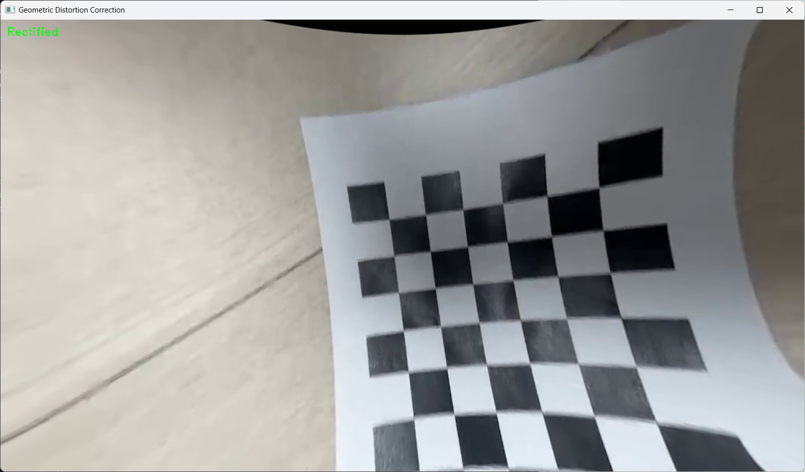

# Chessboard-calibration
Chessboard Camera calibration using OpenCV

## Camera Calibration Results
* The number of selected images = 10
* RMS error = 0.834193513857853
* Camera matrix (K) =
[[1.13722417e+03 0.00000000e+00 6.32839258e+02]
 [0.00000000e+00 1.13416306e+03 3.51127950e+02]
 [0.00000000e+00 0.00000000e+00 1.00000000e+00]]
* Distortion coefficient (k1, k2, p1, p2, k3, ...) = [ 1.67489539e-01  1.60934984e-01  7.70732965e-04  1.45231734e-03
 -2.21783999e+00]

 ## 보정
 
휴대폰 카메라로 찍어서인지 이미 너무 잘 보정이 잘 적용되어 있어서 일부러 넓혀보았음음